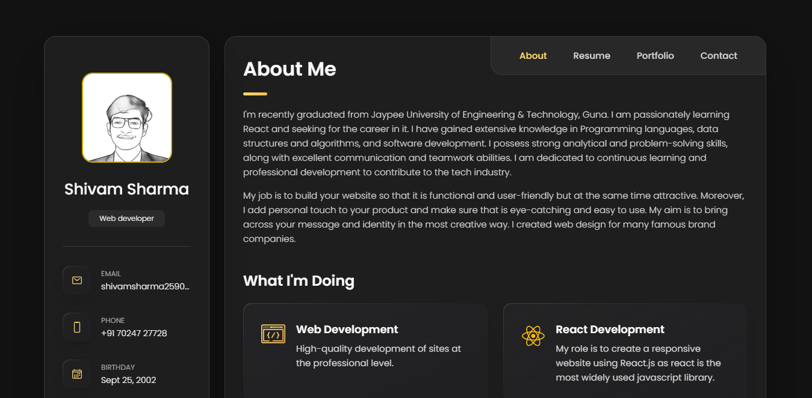

<h2 align="center">
  Portfolio Website<br/>
  <a href="https://about-shivam.netlify.app/" target="_blank">about-shivam</a>
</h2>
<div align="center">
  
</div>

<br/>

<center>

[](https://forthebadge.com) &nbsp; 
[](https://forthebadge.com) &nbsp;
[](https://forthebadge.com) &nbsp;

</center>

<h3 align="center">
    🔹
    <a href="https://github.com/ShivamB19/PersonalPortfolio/issues">Report Bug</a> &nbsp; &nbsp;
    🔹
    <a href="https://github.com/ShivamB19/PersonalPortfolio/issues">Request Feature</a>
</h3>

## TL;DR

You can fork this repo to modify and make changes of your own. Please give me proper credit by linking back to [ShivamB19](https://github.com/ShivamB19/PersonalPortfolio). Thanks!

## Built with

Personal Portfolio Website <a href="https://about-shivam.netlify.app/" target="_blank">about-shivam</a> which features some of my github projects as well as my resume and technical skills.<br/>

This project was built using these technologies.

- HTML
- CSS3
- Javascript
- VsCode
- Netlify

## Features

**📖 Multi-Page Layout**

**🎨 Styled with CSS to customize colors**

**📱 Fully Responsive**


## Prerequisites

Before you begin, ensure you have met the following requirements:

* [Git](https://git-scm.com/downloads "Download Git") must be installed on your operating system.

## Installing portfolio website

To install **portfolio**, follow these steps:

Linux and macOS:

```bash
sudo git clone https://github.com/shivamB19/PersonalPortfolio.git
```

Windows:

```bash
git clone https://github.com/shivamB19/PersonalPortfolio.git
```
## Contact Me

If you want to contact me you can reach me at [Instagram] : https://www.instagram.com/shivamsharmaa25_ 

### Show your support

Give a ⭐ if you like this website!
